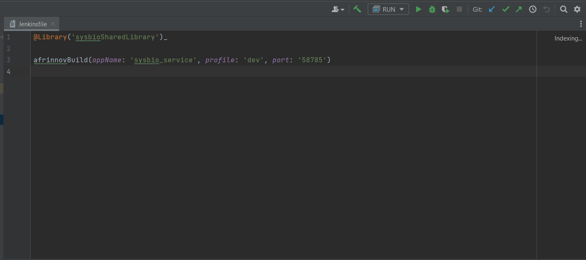
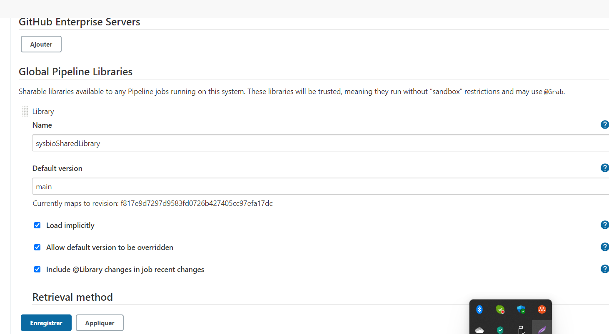

# afrinnov-cicd

## Special Thanks
https://www.tutorialworks.com/jenkins-shared-library/

## Exécution du projet Groovy

### 1- Télécharger "apache-groovy-sdk"

### 2- Configurer Groovy sdk dans Intellij Idea

### 3- Ajouter une configuration pour le projet

## Comment utiliser afrinnov-cicd dans un projet

#### Utilisation de la librairie dans un projet.

- *ligne 1*: Importation de la librairie 
- *ligne 3*: appel de la fonction ***afrinnovBuild*** avec les paramètres 

#### Intégration de la librairie dans l'application [Jenkins](http://37.187.88.37:8089/). 

Administrer Jenkins >Configurer le système>

**Name**: le nom de la fonction qui sera importé dans ***jenkinfile*** du projet de la *ligne 1* 

